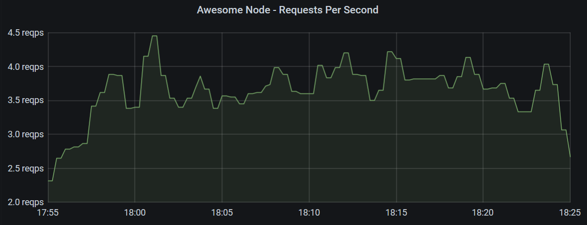
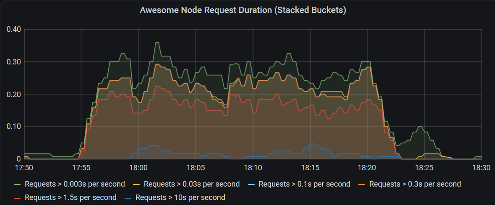
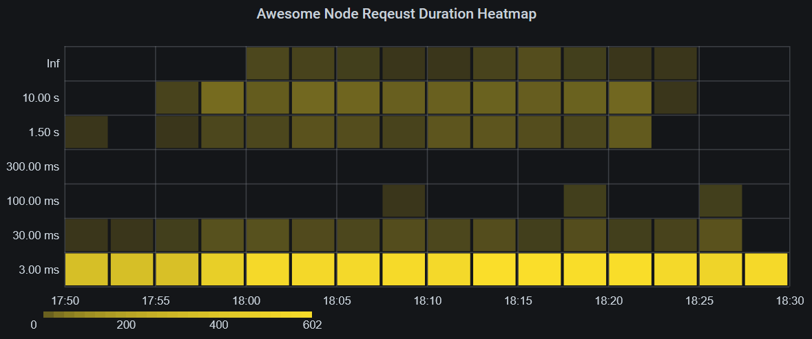
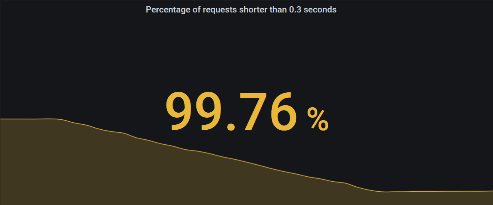
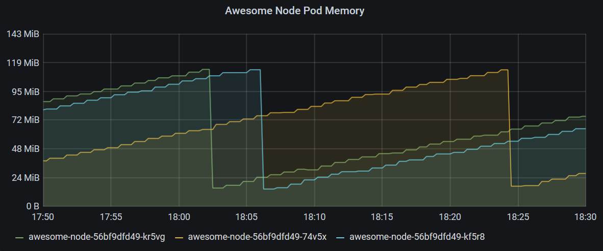
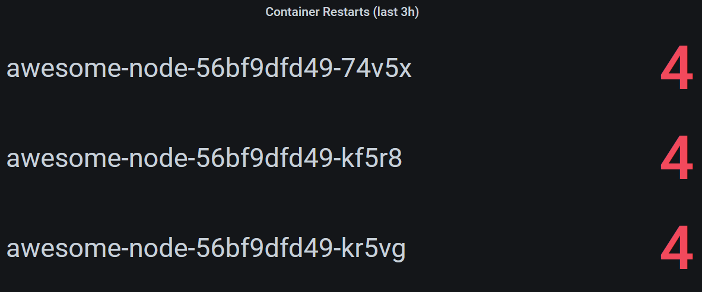

Many Kubernetes deployments include Prometheus and Grafana, so application teams can monitor their applications. While using Grafana may be relatively straightforward for many, the Prometheus data model and its query language PromQL is unknown and unintuitive to many developers. This blog post explains how to create a dashboard with a popular set of metrics for your Node.js applications on Kubernetes.


## Prerequisites

We assume you have access to a Kubernetes cluster with the following components installed:

- Prometheus server that scrapes your applications
- Grafana, with the Prometheus instance as a preconfigured data source

Combining your application metrics with metadata from Kubernetes allows more informative dashboards. We therefore recommend installing the following components too. They will be required for the Kubernetes metadata section of this post.

- Prometheus Node Exporter, which enables Prometheus to scrape information such as CPU and memory usage
- Kube State Metrics, which provides Kubernetes information in the Prometheus metrics format

## Exporting Metrics

Prometheus uses HTTP polling to scrape metrics. Therefore, your application needs to provide an HTTP endpoint exposing its internal metrics.

### Metric Format

Prometheus uses a simple text based format as shown below. The [Prometheus docs](https://prometheus.io/docs/instrumenting/exposition_formats/#text-format-example) provide more information.

```txt
# HELP http_request_duration_seconds duration histogram of http responses labeled with: status_code, method
# TYPE http_request_duration_seconds histogram
http_request_duration_seconds_bucket{le="0.003",status_code="200",method="GET"} 1204
http_request_duration_seconds_bucket{le="0.03",status_code="200",method="GET"} 1214
http_request_duration_seconds_bucket{le="0.1",status_code="200",method="GET"} 1215
http_request_duration_seconds_bucket{le="0.3",status_code="200",method="GET"} 1215
http_request_duration_seconds_bucket{le="1.5",status_code="200",method="GET"} 1230
http_request_duration_seconds_bucket{le="10",status_code="200",method="GET"} 1257
http_request_duration_seconds_bucket{le="+Inf",status_code="200",method="GET"} 1260
http_request_duration_seconds_sum{status_code="200",method="GET"} 159.43762229599974
http_request_duration_seconds_count{status_code="200",method="GET"} 1260
.
.
.

# HELP up 1 = up, 0 = not up
# TYPE up gauge
up 1
```

You can see, in this case the endpoint exposes multiple metrics called `http_request_duration_seconds_bucket` with different values for the `le` label. These are duplicated for other status codes, but those have been omitted in this example. When Prometheus scrapes the endpoint, it will add additional labels to provide metadata for later queries. Prometheus features built-in service discovery options for adding Kubernetes metadata such as the namespace of the pod, the pod name, and Kubernetes labels assigned to the pod.

The `http_request_duration_seconds_count` metric from above may look something like this after scraping:

```txt
http_request_duration_seconds_count{app="awesome-node", instance="10.244.2.130:8080", job="kubernetes-pods", kubernetes_namespace="awesome-node", kubernetes_pod_name="awesome-node-56bf9dfd49-74v5x", method="GET", pod_template_hash="56bf9dfd49", status_code="200"}
```

### Libraries for Node.js

There are a number of libraries available for Node.js that export some basic metrics for many Node.js webservers.

In this example we're going to use the [Express Prometheus Bundle](https://github.com/jochen-schweizer/express-prom-bundle), which also supports Koa, and exposes metrics very suitably for the Prometheus data model and query language.

The Express Prometheus Bundle automatically exports a number of useful metrics related to request duration and is based on [prom-client](https://github.com/siimon/prom-client) which you can use to export additional custom metrics for your application.

## Example Application

In this example, we're working with bespinian's Express based [Awesome Node](https://github.com/bespinian/awesome-node) example application. It's deployed into a namespace called `awesome-node`, exports metrics using the Express Prometheus Bundle and is running 3 replicas.

If your application already exposes metrics and is set up in your Kubernetes cluster, follow along and implement the dashboard as we go. Otherwise it may be a good exercise to deploy the Awesome Node application and set up the sample dashboard using the data it generates.

## Requests Per Second

Let's start creating some diagrams. In a first panel, you may want to show a graph, plotting requests per second to your application over time such as the one below.



This Grafana panel shows requests per second hitting all instances of the application over 30 minutes using the following query.

```promql
sum by (app) (rate(http_request_duration_seconds_count{app="awesome-node"}[2m]))
```

The query is retrieving a range vector over 2 minutes with data points of the `http_request_duration_seconds_count` metric with the label `app` set to `awesome-node`.
In our example Prometheus scrapes the metrics every minute, so with every two minute interval there should be between 1 and 3 data points.

The `rate()` function then calculates the average rate per second with respect to the exact intervals between data points.

This still results in multiple metrics which are different in their `satus_code` and `kubernetes_pod_name` labels and can be summed up to give a single number for the whole application.

To display a graph over time, Grafana makes a query range over 30 minutes with 15 second intervals (these values can be configured differently in Grafana). Prometheus then calculates the query for each of those intervals, allowing Grafana to plot a chart.

### The Counter Metric Type

In this graph, we used the counter metric type, which is monotonically increasing. With such metrics we are usually interested in the relative increase in a range rather than in their absolute value. The `rate()` function calculates this increase and takes into account the exact time between each two data points. It also accounts for counter resets, which may happen when an instance restarts.

### The Gauge Metric Type

Unlike counters, gauges are metrics that can also decrease in value. As such they are very intuitive to use and do not require derivation or the use of the `rate()` function.

Examples for gauges could be temperature or CPU load. However, measuring CPU load using gauges may not be advised, since the gauge only represents a snapshot at sampling time and does not take into account any variation between two samples. Therefore tools like Prometheus Node Exporter export CPU usage in seconds as a counter type metric.

## Request Performance

Our application's metrics endpoint exports `http_request_duration_seconds_bucket` metrics with different values `n` for the `le` label, which indicates, how many requests were shorter than `n` seconds. These buckets together with the metrics `http_request_duration_seconds_sum` and `http_request_duration_seconds_count` form a so-called histogram metric.

We need to note that the buckets in a histogram metric are not exclusive. A request that took 0.7 seconds is counted once in each of the buckets `le: 1.5`, `le: 10` and `le: +Inf`. This simplifies calculating ratios and percentages, but requires a subtraction to get information about how many requests were e.g. between 1.5 and 10 seconds.

This histogram allows us to monitor whether our application is performing well and within its service level objectives. We will now look into different ways of visualizing the histogram data. Depending on your use case you may choose one or the other.

### Histogram Graph Charts

The simplest chart just displays all the buckets of the histogram as individual graphs.


The following query calculates the rate for each bucket and pod and then sums that up by bucket to produce the chart above.

```promql
sum by (le) (rate(http_request_duration_seconds_bucket{kubernetes_namespace="awesome-node"}[3m]))
```

A drawback of this chart is, that most of the requests are in the bucket `le: 0.003` and the graphs representing other buckets all get crammed into a very tiny space.

We can exclude the bucket for the shortest requests and remove them from the sum by turning the buckets around and calculating the request counts that are larger than the `le` thresholds.



Use the query below to produce this chart:

```promql
sum by (app, le) (rate(http_request_duration_seconds_count{app="awesome-node"}[3m]) - ignoring (le) group_right rate(http_request_duration_seconds_bucket{le!="+Inf"}[3m]))
```

> #### Query Explanation
>
> This query uses [one-to-many](https://prometheus.io/docs/prometheus/latest/querying/operators/#many-to-one-and-one-to-many-vector-matches) matching to subtract many metrics (the buckets) from a single metric (the count). In order to support this, we need to tell Prometheus that the right part has the higher cardinality using the `group_right` modifier.
>
> Furthermore, by default Prometheus matches metrics with matching label values. However, in this case the `le` label is only available on the buckets. For the matching operation to succeed, we tell it to ignore the `le` label, by adding the `ignoring (le)` modifier.

### Histogram Heatmap

Another interesting way to visualize histograms are heatmaps and Grafana's heatmap implementation is well suited for it.



As you can see on this heatmap, the amount of long requests is clearly shown in the upper parts of the heatmap with a more intense colour indicating more requests in that bucket.
Optimally, only the bottom 1-3 rows should be colored at all, with few exceptions.

The query to produce this heatmap is quite simple:

```promql
label_replace(sum by (le) (increase(http_request_duration_seconds_bucket{app="awesome-node"}[$__rate_interval])), "le", "Inf", "le", "\\+Inf")
```

> #### Note!
>
> Using absolute numbers instead of rates per second can be practical when grouping into larger intervals such as in this use case.
>
> The `label_replace()` function is used here to replace the `le: +Inf` label with `le: Inf`, because Grafana would use the `+Inf` label incorrectly.
>
> We're using the $\_\_rate_interval instead of a fixed timespan such as `3m` to ensure all data points are counted only once and within the correct heatmap section.

The metric needs to be configured as a heatmap in Grafana and in this case it is useful to scale down the resolution of the heatmap.


> #### Important!
>
> In the panel section of the Grafana panel, on the `Axis` subsection, make sure to select `Time series buckets` in the `Data Format` field.

Your heatmap should now be properly displayed.

I recommend you hide 0 values and experiment with the colors. In the example, it was useful to chose `opacity` as the color mode and use `sqrt` as the scale to increase the contrast of bucket counts with low values.

### The Summary Metric Type

The last example should have helped you get familiar with the histogram metric type.

We now turn to the summary metric type which concludes the 4 basic metric types in Prometheus.

A summary metric is similar to a histogram, as it is also a composite of multiple single metrics, but it is different, in that it calculates a set of quantiles (e.g. the 50th, 90th, 95th and 99th percentiles) exactly. This type of metric is more complex to calculate for export but is the best way to get exact quantiles, when you need them.

Prometheus also allows you to calculate quantiles from histograms using the [histogram_quantile() function](https://prometheus.io/docs/prometheus/latest/querying/functions/#histogram_quantile), but this function uses interpolation to calculate the quantiles and therefore is not exact.

## Monitoring Your Service Level Objectives

A service level objective is often stated by requiring that a percentage of requests over a certain time period are shorter than a specific threshold, for example "99 percent of requests must be served in under 0.3 seconds over any 24 hour period". Usually the time period is measured in days (as in the example), weeks, or months. In our example, the percentage of requests shorter than 0.3 seconds over 24 hours would be called a service level indicator (SLI), and we want to show it on our dashboard using the following query.

```promql
(sum by (app) (increase(http_request_duration_seconds_bucket{app="awesome-node", le="0.3"}[1d])) / sum by (app) (increase(http_request_duration_seconds_count{app="awesome-node"}[1d]))) * 100
```

In this case we are interested in a single number, therefore we want to use a stat panel.



Below the number the stat can also show a graph giving you an indication of whether your SLI is heading up or down, or keeping steady.

The single stat can be configured to change colors based on certain thresholds in the "Thresholds" section of the "Field" tab in Grafana. In this case I configured it to be red, when the SLI is below 99%, yellow, when it's lower than 99.9%, and green only if it's greater than or equal to 99.9%. You can see these thresholds are applied in the screenshot above, where the value 99.76% for our SLI is between 99% and 99.9% and therefore turned yellow.

## CPU And Memory Usage

The application does not output CPU and memory usage information on its metrics endpoint. Instead, in our case, this information is scraped by Prometheus directly from the Kubernetes nodes themselves, using the Prometheus Node Exporter, which exposes statistics from the virtual machines as metrics and supports labelling these metrics with Kubernetes metadata, such as pod and namespace information.



In this chart, we're showing the memory usage of all pods in the namespace `awesome-node` where the pod name starts with `awesome-node-`.

> #### Note!
>
> Prometheus supports regex queries for metric labels using the `=~` operator.

```promql
container_memory_working_set_bytes{namespace="awesome-node", pod=~"awesome-node-.*", container=""}
```

Additionally, we only select the metric, where the `container` label is not present, since this metric is the memory usage of the whole pod, whereas the other metrics focus on the individual containers of a pod.

> #### Note!
>
> The resets in memory you see here are due to container restarts happening because of a memory leak purposefully built into the Awesome Node application.

To display CPU metrics, we also use a graph chart and query a counter, measuring CPU seconds used. Since this is a counter, it is useful to use the `rate()` function again to get the increase in CPU as shown in the query below.

```promql
rate(container_cpu_user_seconds_total{pod=~"notification-api-deployment-.*", container=""}[2m])*1000
```

This query returns CPU millicores used, since in Kubernetes we frequently use the millicores unit to limit the CPU resources one pod or container can use.

## Container Restarts

In our example, some containers seem to be restarting frequently. If you want to show pods that recently had restarts, use a stat panel and query the `kube_pod_container_status_restarts_total` metric.

This metric is exported by the Kube State Metrics component, which monitors the state of Kubernetes objects and provides an endpoint for Prometheus to scrape.



This panel will be empty, if no containers had any restarts within the last 3 hours and can be produced using the following query.

```promql
increase(kube_pod_container_status_restarts_total{namespace="awesome-node"}[3h]) > 0
```

## Summary

While Grafana and the Prometheus metric format are themselves relatively easy to understand, creating useful dashboards requires getting familiar with PromQL and Prometheus' data model.

When designing dashboards, querying Prometheus directly or choosing how to expose metrics in your applications, keep the following in mind:

- Counters provide valuable insight when used in combination with the `rate()` or `increase()` functions.
- The structuring of histograms into buckets enables a wide range of visualizations for your service level indicators and performance measurements.
- Incorporating metadata generated by Kubernetes components allows you to observe individual pods or even containers of your application.

### Example Dashboard

We created an example dashboard with the visualizations created in this example and a few more for you to explore. You can [download](https://gist.github.com/elessar-ch/42f0eb278aedd27d3b20f4ea490902c7) it and use Grafana's import function to get started.

### What's Next?

The natural next step, once your dashboard is up and running, is setting up alerting, so you're catching problems early and even when you are not looking at your dashboard. Check out [Prometheus' Alertmanager](https://www.prometheus.io/docs/alerting/latest/alertmanager/) on how to set it up and configure alerts based on your metrics in Prometheus.
