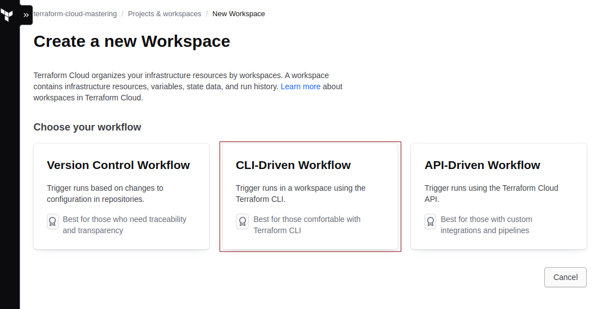
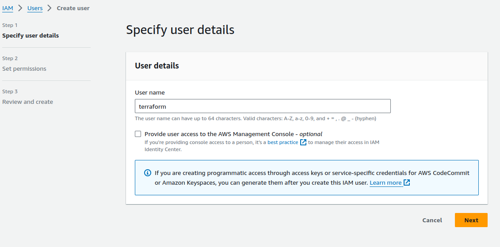
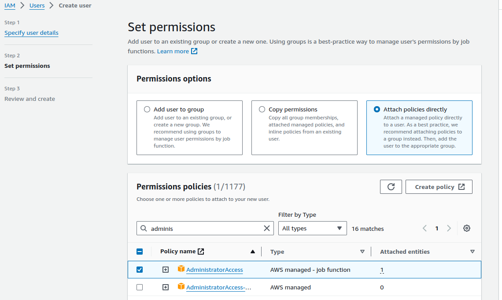
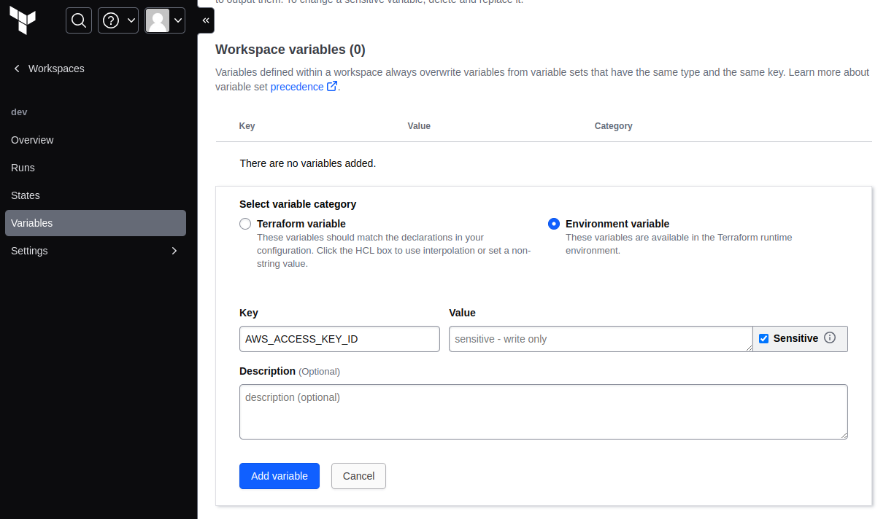
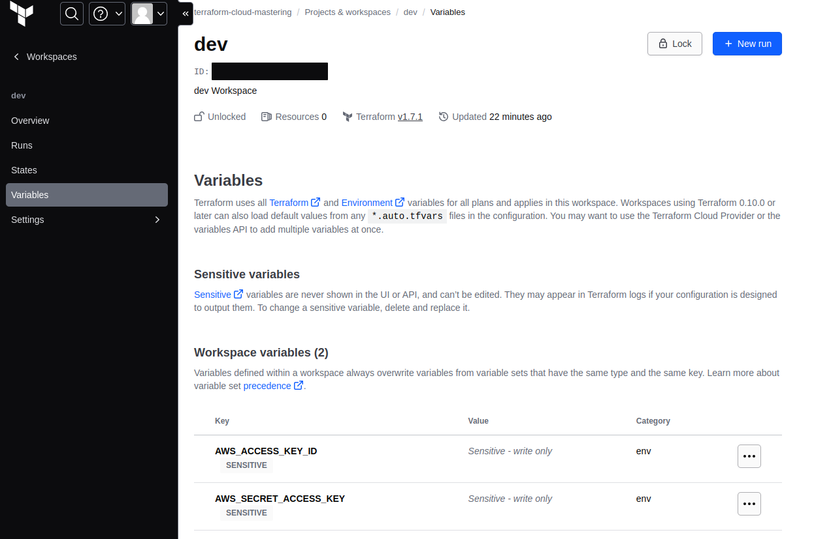
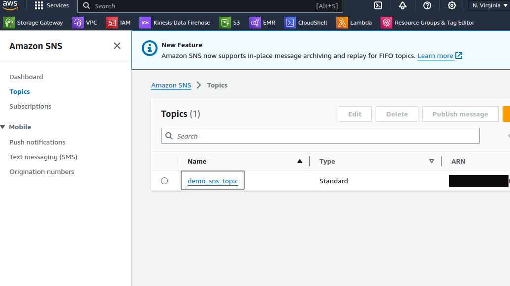
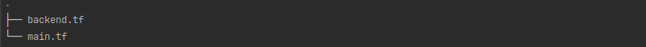
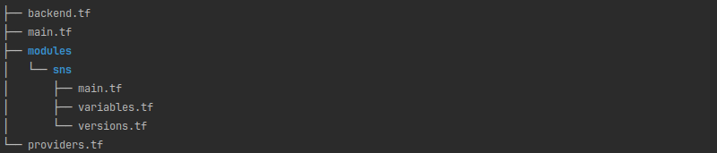

> The code for this example can be found on [bespinian's GitHub](https://github.com/bespinian/terraform-aws-multi-region)

## Introduction

When you begin your journey with Terraform, it's common practice to start small, focusing on creating and managing resources within a single AWS region.

This approach allows you to get better understanding of Terraform, and it's syntax, understand execution plan and state management, and grasp the fundamentals of infrastructure as code (IaC).

Multi-region deployment in AWS is essential for various reasons, including improved application availability, reduced latency for global users, and a robust disaster recovery strategy.

However, replicating your infrastructure across multiple regions can introduce complexity.

Without the right tools and practices, you might find yourself duplicating effort, managing extensive configurations, and navigating the challenges of keeping your infrastructure consistent across regions.

This is where Terraform, combined with strategic planning and organization, can significantly simplify the process.

## Prerequisites

- Existing AWS and Terraform Cloud accounts
- AWS CLI and Terraform CLI installed and configured on the local machine

## Creating Your Terraform Cloud Workspace

Creating a Terraform Cloud workspace is a fundamental step toward structuring and managing your infrastructure projects in a more organized, secure, and collaborative manner.

For our setup, we will create a new CLI-Driven Workspace:



## AWS Generating Access Keys

If we want to connect our terraform cloud workspace with AWS we would need to create Access and Secret Keys for that follow the following steps:

### 1. IAM -> Users -> Create user



### 2. Set permissions



### 3. Create access and secret key

#### 3.1 IAM -> Users -> select the terraform user

#### 3.2 Under the `Security credentials` click on the `Create access key`

#### 3.3 select the `CLI` option and `Create access key`

In the next chapter, we will add `Access key` and `Secret access key` into the terraform cloud workspace.

## Integrating Terraform Cloud with AWS

In the terraform cloud newly created dev workspace add new Variables

- `AWS_ACCESS_KEY_ID`



- `AWS_SECRET_ACCESS_KEY`



## Deploy resource to single region with Terraform

We will start with deployment to single region, and then we will refactor our code to support multi region deployment.

- Login to terraform cloud via the terraform CLI
  `terraform login`

- Create `backend.tf` with the terraform cloud and aws provider

```shell
terraform {
  cloud {
    organization = "terraform-cloud-mastering"

    workspaces {
      name = "dev"
    }
  }

  required_providers {
    aws = {
      source = "hashicorp/aws"
      version = "5.34.0"
    }
  }
}

provider "aws" {
  region = "us-east-1"
}
```

- Initializes a working directory containing Terraform configuration files

```shell
tf init
```

- If everything is ok you should see the following message

```shell
Terraform Cloud has been successfully initialized!
```

### Create our first resource

In this example we will create the SNS resource in the default `us-east-1` region, the one which we have defined in the `backend.tf`

- Create main.tf file in the same working directory

```shell
resource "aws_sns_topic" "sns_example" {
  name           = "demo_sns_topic"
  display_name   = "Demo SNS Topic"
}
```

- Run the `terraform plan`
- You should see the output telling you which resources will be created

```shell
Terraform will perform the following actions:

  # aws_sns_topic.sns_example will be created
  + resource "aws_sns_topic" "sns_example" {
      + arn                         = (known after apply)
      + beginning_archive_time      = (known after apply)
      + content_based_deduplication = false
      + display_name                = "Demo SNS Topic"
      + fifo_topic                  = false
      + id                          = (known after apply)
      + name                        = "demo_sns_topic"
      + name_prefix                 = (known after apply)
      + owner                       = (known after apply)
      + policy                      = (known after apply)
      + signature_version           = (known after apply)
      + tags_all                    = (known after apply)
      + tracing_config              = (known after apply)
    }
```

- Run the `terraform apply`
- New resource should be created in the aws
  

- Our single region deployment files



## Module-Based Deployment: Expanding to Multi-Region Architecture

### Let's refactor our `main.tf` and create our first terraform module

- Create a directory `modules/sns`

- Move `main.tf` into this directory

- Create a new file `variables.tf` to have configurable topic name and topic display name

```shell
variable "topic_name" {
  type = string
}

variable "topic_display_name" {
  type = string
}
```

- Adjust the `main.tf` file to incorporate the variable designated for the SNS topic's name, ensuring the SNS topic resource now references this variable for its naming convention

```shell
resource "aws_sns_topic" "sns_example" {
  name           = var.topic_name
  display_name   = var.topic_display_name
}
```

- To establish consistency and manage dependencies in our Terraform project, we will create a `versions.tf` file

- This file will outline the required providers, including their respective versions, to ensure compatibility and stable functionality within our infrastructure configurations

```shell
terraform {
  required_providers {
    aws = {
      source = "hashicorp/aws"
      version = "5.34.0"
    }
  }
}
```

### Refactoring the Root Project Directory

- Create `providers.tf`, within this new file, we will introduce an additional AWS region configuration, utilizing an alias, to facilitate the differentiation of providers on the basis of their aliases

```shell
provider "aws" {
  region = "us-east-1"
  alias   = "us-east-1"
}

provider "aws" {
  region = "us-east-2"
  alias   = "us-east-2"
}
```

- Let's now create module for each region within the `main.tf` file at the root of our project directory

```shell
module "us-east-1" {
  source = "./modules/sns"
  providers = { aws = aws.us-east-1}

  topic_name = "demo-sns-us-east-1"
  topic_display_name = "Demos SNS"
}

module "us-east-2" {
  source = "./modules/sns"
  providers = { aws = aws.us-east-2}

  topic_name = "demo-sns-us-east-2"
  topic_display_name = "Demos SNS"
}
```

Multi-region folder structure


This approach will create an SNS topic in each region

One strategy for implementing multi-region infrastructure deployment involves utilizing multiple providers

Keep an eye out for our upcoming blog posts, where we will explore how to achieve nearly identical outcomes by using multiple Terraform Cloud workspaces
