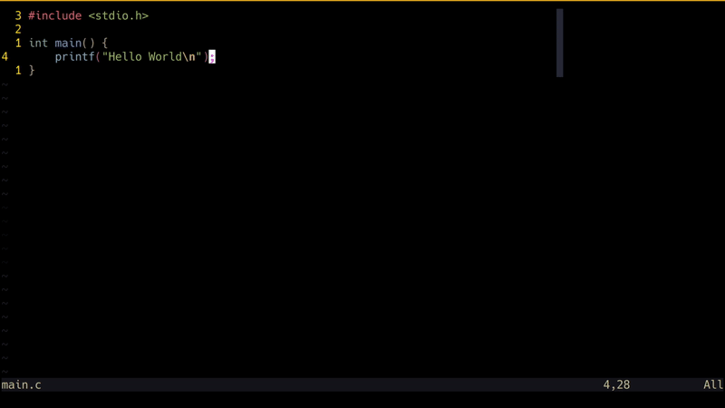
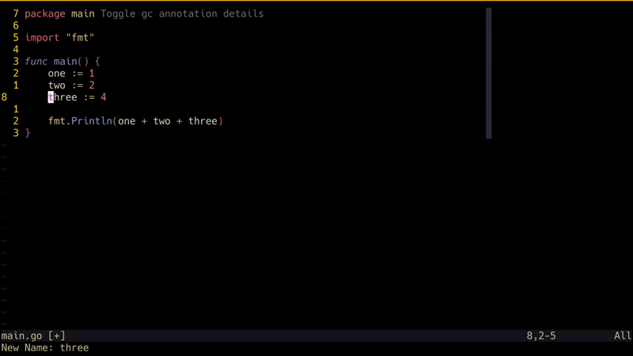
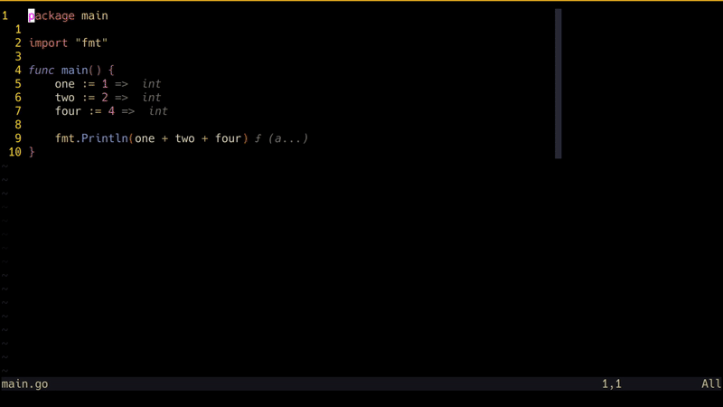

Since it's near the end of 2023, I am sure everyone is quite busy with family
and other festive obligations. I am going to keep this one short and introduce
you to one Vim feature that, if you don't use it already, will have you excited
to get back to your beloved editor in 2024.

<!--more-->

## An Addiction

If you are anything like me, then Vim is so deeply ingrained in you that you
find yourself accidentally typing `:w` or its friends in all sorts of text
inputs. Vim motions have taken over your brain to the point that you find it
difficult to type in “traditional” text inputs. Perhaps your Vim addiction is so
bad that you have Vi mode configured everywhere you can.

You feel like a well-oiled machine, navigating your browser, your file system,
and even editing commands in your shell using Vim motions. However, when you hit
`:` to enter your beloved Vim's
[Command-line-mode](https://neovim.io/doc/user/cmdline.html) and want to follow
up with something more than `w` or `q`, something feels off. You make a typo or
forget a flag, and there it is. Your fingers seek awkwardly for the arrow keys,
you're reaching for your backspace, and every time you inadvertently hit escape,
it's game over.

## Command-line Window

The so-called,
[Command-line-window](https://neovim.io/doc/user/cmdline.html#cmdline-window)
(`:h command-line-window`) is one of the less talked-about Vim features, and one
that I personally discovered sometime ago by pure chance.

It is a special window in Vim that allows you to edit text for `command-line`
operations in the same way you edit text normally in Vim. This allows you to
circumvent the awkwardness of searching for arrow keys or using backspace,
allowing you to use the Vim motions you are so comfortable with, in even more
contexts. Additionally, the `command-line-window` is also populated with your
command or search history from previous operations, allowing you to modify a
recently run command or search using Vim motions. Another advantage of using
`command-line-window` is that you can also hook into your non-native
autocompletion suggestions for `command-line` operations.

The command-line-window can be accessed in several ways:

- `q:` : Opens `command-line-window` populated with your recent `Ex` commands
- `q/` or `q?` : Opens `command-line-window` populated with your recent
  searches. Hitting enter executes a search using the `/` or `?` behaviour.
- `CTRL+f` : Brings up the `command-line-window` when you are already in
  `command-line-mode`.

## In Action

Here are some interesting ways you can integrate `command-line-window` into your
Vim workflow. Keep in mind that these are toy examples intended to seed ideas as
to how you may use `command-line-window` in more complex circumstances.

### Command History

_`Command-line-window` is activated using `q:`. The last `:h` command is then
modified using Vim motions and reissued with `Enter`._

### Search History

_`Command-line-window` is activated using `q/`. A previous search term is then
modified using Vim motions and reissued with `Enter`._

### Filter Command

_`Command-line-window` is activated using `CTRL+f` while already in
`Command-line-mode`. This is then used to insert a missing flag into our
`filter` command using Vim motions._

### LSP Rename

_`Command-line-window` is activated using `CTRL+f` after Neovim's
`vim.lsp.buf.rename` is triggered. Now we can access our recent history of
renames and also use Vim motions to pick a new name for the variable._

### Netrw

 _`Command-line-window` is
activated using `CTRL+f` after the rename command on a directory inside `netrw`
is issued. The file can now be conveniently renamed using Vim motions._

## Happy Vim-ing in 2024

The potential use cases for `command-line-window` go well beyond these simple
examples. Nonetheless, I hope this was a useful introduction to a feature that
bridges a gap that was always missing (and, frankly, irritating) for me in Vim.

This post is dedicated to the late Bram Moolenaar, who passed away in
August 2023. Bram was the creator and
[BDFL](https://en.wikipedia.org/wiki/Benevolent_dictator_for_life) of Vim. Vim
is licensed as [“charityware”](https://en.wikipedia.org/wiki/Careware) and as
conveyed by the call to “Help poor children in Uganda!” in Vim's welcome
message, Bram encouraged users to donate to the
[ICCF Holland](https://www.iccf-holland.org/) charity he founded. If your
end-of-year bonus has you feeling generous, I encourage you to spread the wealth
to those who are less fortunate than people like us, people who spend an
obnoxious amount of time obsessing over text editors.

Happy new year!
